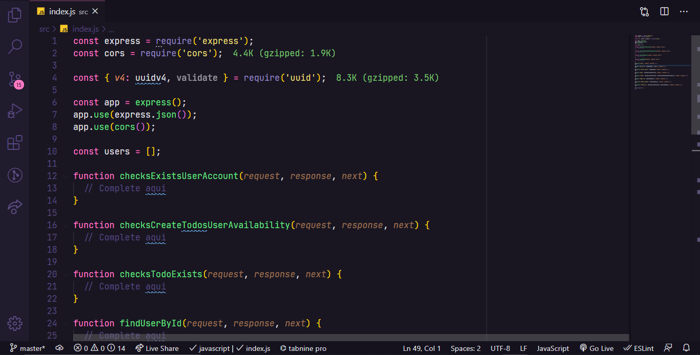

# Ignite NodeJs - Chapter 1 - Desafio 02 - Trabalhando com middlewares

<br/>
<div>
  
</div>


<br/>

# 🚀 Informações sobre o Desafio

#### Nesse desafio tive que trabalhar mais a fundo com middlewares no Express. Dessa forma fui capaz de fixar mais ainda os conhecimentos obtidos até agora. 

 #### Para facilitar um pouco mais do conhecimento da regra de negócio, trabalhei com a mesma aplicação do desafio anterior: uma aplicação para gerenciar tarefas (ou *todos*) mas com algumas mudanças.

<br/>

- Será permitida a criação de um usuário com `name` e `username`, bem como fazer o CRUD de *todos*:

- Criar um novo *todo*;
- Listar todos os *todos*;
- Alterar o `title` e `deadline` de um *todo* existente;
- Marcar um *todo* como feito;
- Excluir um *todo*;

Tudo isso para cada usuário em específico. Além disso, dessa vez teremos um plano grátis onde o usuário só pode criar até dez *todos* e um plano Pro que irá permitir criar *todos* ilimitados, isso tudo usando middlewares para fazer as validações necessárias.
 

<br/>

## 💻 Documentação do desafio

- [Desafio 2 - Chapter 1 NodeJS](https://chip-dryosaurus-9ab.notion.site/Chapter-I-Desafio-02-Trabalhando-com-middlewares-92a7689789ff495b8797e784c33fe18d)

<br/>

## 🖼️ Template do projeto?

- [Template do projeto original para clone](https://github.com/rocketseat-education/ignite-template-trabalhando-com-middlewares)

<br/>

## 🛠️ Tecnologias/Ferramentas ultilizadas

- [NodeJs](https://nodejs.org/en/docs/)
- [Express](https://expressjs.com/pt-br/)
- [Uuid](https://www.npmjs.com/package/uuid)
- [Jest](https://testing-library.com/docs/)

## ⚙️ Instalação

```
# Abra um terminal e copie este repositório com o comando
$ git clone https://github.com/Hugovarellaa/ignite-template-trabalhando-com-middlewares
```

```
# Acesse a pasta da aplicação
$ cd ignite-template-trabalhando-com-middlewares

# Inicie a aplicação
$ yarn dev 
```

---

<p align="center">Feito com 💙 por Hugo Alves Varella</p>